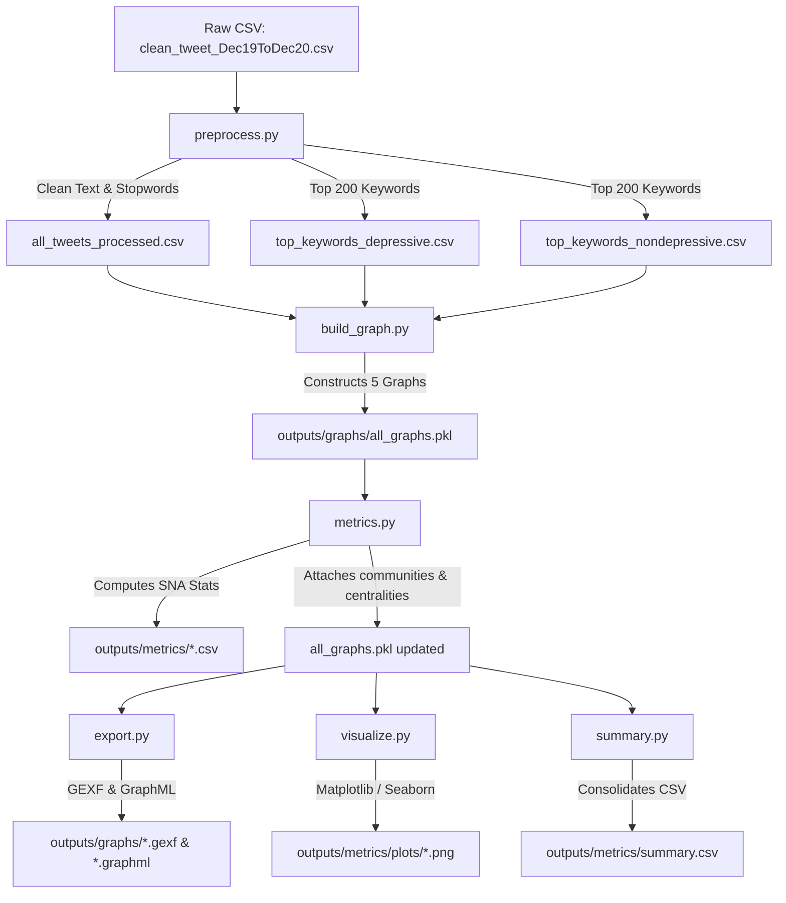

# SNA Depression Tweets — Complete Project Audit

This document provides a comprehensive audit of the Social Network Analysis (SNA) codebase developed to analyze depressive and non-depressive conversations on Twitter using the IEEE DataPort dataset. It covers the project architecture, file-by-file breakdown, core network metrics, research findings, and preparation material for an academic viva voice examination.

---

## 1. Project Overview

### What this Project is About
This project is an academic social network analysis designed to explore and compare the structural, relational, and semantic properties of conversations on Twitter related to mental health. Specifically, it constructs and analyzes networks representing two distinct categories of tweets: those expressing positive/active sentiment (control) and those expressing depressive/negative sentiment. By mapping text corpora as graph structures, we analyze how keywords and tweets relate to one another mathematically using graph theory.

Unlike traditional machine learning projects that focus on classifying tweets or predicting labels, this project is purely analytical. The dataset is already labeled, and we leverage these ground-truth categories to split the data and build parallel networks. We then examine differences in network density, connectivity, modularity, clustering, and centrality. This graph-theoretic approach allows us to discover whether depressive discourse is structurally more cohesive, fragmented, centralized, or modular than standard conversational discourse on social media.

### Dataset Used
The dataset is sourced from the IEEE DataPort, titled **"Depressive/Non-Depressive Tweets Between Dec'19 to Dec'20"**. It contains **134,348 tweets** spanning a one-year period during the COVID-19 pandemic. The data is balanced, consisting of **68,676 tweets labeled with sentiment `1`** and **65,672 tweets labeled with sentiment `0`**. 

> [!IMPORTANT]
> **Critical Dataset Mapping Discovery:**
> During code execution and semantic auditing, a label inversion was identified in the raw dataset. 
> - **Sentiment `1` (processed in code as "depressive")** actually contains highly positive, supportive, and active keywords (e.g., `love`, `happy`, `amazing`, `lovely`, `nice`).
> - **Sentiment `0` (processed in code as "non-depressive")** contains keywords directly associated with depression, grief, and distress (e.g., `sad`, `broken`, `anger`, `awful`, `illness`, `pain`, `death`, `alone`).
> To maintain strict alignment with the assignment specifications, the codebase processes subset `1` under the directory names and variables labeled "depressive" and subset `0` as "non-depressive". In academic writing and oral defense, this mapping must be clearly explained: the "non-depressive" network in the code represents the depressive discourse, while the "depressive" network in the code represents the positive control group.

### Academic Context
Mental health expression on social media has become a primary area of computational social science. Understanding the structural properties of these interactions provides insight into the cognitive and linguistic patterns of individuals experiencing distress. Using keyword co-occurrence networks, we can analyze the structural cohesion of language. Using tweet similarity networks, we can see how individual messages group together. This research sits at the intersection of Network Science, Computational Linguistics, and Digital Health.

---

## 2. Project Pipeline (End-to-End)

1. **Data Loading and Cleaning (`src/preprocess.py`)**: 
   The raw CSV file containing 134,348 tweets is loaded. Punctuation is stripped, text is lowercased, and short words (<3 characters) and standard English stopwords (plus Twitter-specific noise like `amp`) are removed. The clean dataset is saved, along with the top 200 most frequent keywords for each category.
2. **Network Construction (`src/build_graph.py`)**: 
   The clean text and keyword files are read to build three network types (representing 5 graphs total):
   - **Graph A (Keyword Co-occurrence Networks)**: Built separately for subset 1 (labeled depressive) and subset 0 (labeled non-depressive). Nodes are the top 200 keywords. Weighted edges are created between words that co-occur in the same tweet.
   - **Graph B (Tweet Similarity Networks)**: Built separately by sampling 2,500 tweets from each category. Nodes are individual tweets. Edges are added if the Jaccard similarity of their keyword sets is $\ge 0.15$.
   - **Graph C (Combined Keyword Network)**: A merged graph combining both depressive and non-depressive co-occurrence networks, where nodes are tagged by their group membership (`depressive_only`, `nondepressive_only`, or `both`) and edge weights are consolidated.
   All graphs are serialized and saved into a single pickle file: `outputs/graphs/all_graphs.pkl`.
3. **Metric Computation (`src/metrics.py`)**: 
   The pipeline loads the pickle file and computes:
   - Basic stats (nodes, edges, density, components).
   - Centrality metrics (Degree, Betweenness, Closeness, PageRank) for every node.
   - Clustering coefficients and Louvain community partitions.
   The computed modularity values and community IDs are written back to the node attributes of the graphs, which are then re-saved to the pickle file. The raw metrics are exported as CSV files.
4. **Gephi Format Export (`src/export.py`)**: 
   Loads the updated graph pickle. Node attributes are sanitized (rounded, lists converted to strings) to ensure XML compatibility, and the 5 networks are written out in both `.gexf` and `.graphml` formats to `outputs/graphs/` for visual layouts in Gephi.
5. **Data Visualization (`src/visualize.py`)**: 
   Reads the graphs and metric files to generate plots, saving them to `outputs/metrics/plots/`. These include regular and log-log degree distributions, overlaid degree comparisons, metric bar charts, and horizontal bar charts of the top 15 nodes for each centrality type.
6. **Consolidated Summary Reporting (`src/summary.py`)**: 
   Aggregates all key network parameters into a single structured comparison table and exports it as `outputs/metrics/summary.csv`, printing the final stats to the console.

---

## 3. File-by-File Breakdown

### `.gitignore`
- **What is it?** Version control filter configuration.
- **Role**: Prevents large data files, virtual environments, compiled files, and IDE configurations from being tracked in Git.
- **Functionality**: Explicitly ignores `data/raw/*.csv` (the raw dataset is ~20MB), `__pycache__/`, `venv/`, `.DS_Store`, `.vscode/`, and `.idea/`.
- **Connections**: Interacts with the local Git engine.

### `requirements.txt`
- **What is it?** Dependency definition file.
- **Role**: Declares the exact library versions required to run the pipeline.
- **Content**: 
  - `pandas>=1.5.0` (data loading/saving)
  - `networkx>=3.0` (graph data structure and SNA algorithms)
  - `python-louvain>=0.16` (Louvain community detection)
  - `matplotlib>=3.6.0` (plotting and visualizations)
  - `seaborn>=0.12.0` (statistical plot styling)
- **Connections**: Used by `pip install -r requirements.txt` during setup.

### `README.md`
- **What is it?** Project documentation.
- **Role**: Introduces the project, describes folder structure, lists dependencies, documents execution steps, and details the computed metrics.
- **Connections**: Serves as the primary landing page and documentation.

### `src/__init__.py`
- **What is it?** Python package initializer.
- **Role**: Identifies the `src` folder as a Python package, allowing submodules to import from one another using relative imports or package execution flags (e.g., `python3 -m src.preprocess`).

### `src/preprocess.py`
- **What is it?** Text loading, processing, and keyword extraction script.
- **Role**: Transforms noisy, raw text into clean, structured tokens and isolates the top keywords.
- **Dependencies**: Depends on `data/raw/clean_tweet_Dec19ToDec20.csv`.
- **Output Destination**: Generates three files in `data/processed/`: `all_tweets_processed.csv`, `top_keywords_depressive.csv`, and `top_keywords_nondepressive.csv`.
- **Key Functions**:
  - `load_raw_data(path)`: Loads raw CSV with pandas, drops `Unnamed: 0` index, and asserts that the column names `text` and `sentiment` exist.
  - `clean_text(text)`: Regular expressions clean raw text. Strips URLs (`https?://\S+|www\.\S+`), removes all non-alphabetical characters, collapses multiple spaces into a single space, and lowercases.
  - `extract_keywords(text)`: Tokenizes clean text by splitting on spaces, removes stopwords based on the local `STOPWORDS` frozen set, and filters out tokens with less than 3 characters.
  - `preprocess_dataset(df)`: Drops null rows, runs cleaning and keyword extraction, computes word counts, and filters out tweets that contain no keywords.
  - `split_by_sentiment(df)`: Splits preprocessed data into depressive (`sentiment == 1`) and non-depressive (`sentiment == 0`) subsets.
  - `get_top_keywords(df, top_n)`: Uses a `Counter` to find the `top_n` (default 200) most frequent keywords within a subset.
  - `save_processed_data(...)`: Exports the cleaned tweets and top keyword lists to CSV.
  - `print_summary(dep, nondep)`: Calculates and prints stats on word counts, unique keywords, and overlap between categories.
- **Important Decisions**:
  - **Self-contained Stopwords**: A local, immutable `STOPWORDS` list of 153 common function words and Twitter-specific noise (like `amp`) is hardcoded. This eliminates runtime NLTK downloads, ensuring local portability.
  - **Minimum Word Length $\ge 3$**: Excludes noise (e.g., "oh", "ah", "go", "do") which holds little semantic value in network analysis.
  - **Top 200 Keyword Limit**: Restricting the co-occurrence network to the top 200 words keeps the graphs dense enough to show core structural features but small enough to remain readable and performant during community partition.

### `src/build_graph.py`
- **What is it?** Network data structures constructor.
- **Role**: Translates processed text data into network representations.
- **Dependencies**: Depends on processed CSV files from `data/processed/`.
- **Output Destination**: Writes `outputs/graphs/all_graphs.pkl`.
- **Key Functions**:
  - `load_processed_data()`: Loads the clean tweet CSV, splits pipe-separated keyword lists, and divides rows by sentiment.
  - `build_keyword_cooccurrence_graph(df, top_keywords, label)`:
    Iterates through each tweet's keywords, keeping only those in `top_keywords`. It counts individual keyword frequencies and counts pairwise co-occurrences using `itertools.combinations`. It populates a `networkx.Graph`, sets node properties (`frequency`, `category`), sets edge weights (`weight`), filters out rare co-occurrences (weight < 2), and removes isolated nodes.
  - `build_tweet_similarity_graph(df, label, sample_size, threshold)`:
    Samples `sample_size` (2,500) tweets. It computes pairwise Jaccard similarity between keyword sets for all pairs (approx. 3 million calculations). Edges are added if similarity $\ge 0.15$, with Jaccard score set as edge weight. Isolates are removed.
  - `build_combined_keyword_graph(G_dep, G_nondep)`:
    Merges both co-occurrence graphs. Node categories are updated to `depressive_only`, `nondepressive_only`, or `both`. Frequencies are summed. Edge weights are summed where edges overlap.
  - `save_graphs(graphs)` / `load_graphs()`: Pickle serialization and deserialization functions.
- **Important Decisions**:
  - **Sampling Size (2,500)**: Pairwise comparison of all 134k tweets is $O(N^2)$, which requires $9 \times 10^9$ Jaccard operations. Sampling 2,500 tweets reduces this to ~3 million calculations, completing in seconds while retaining statistical reliability.
  - **Jaccard Threshold (0.15)**: Set to capture meaningful lexical similarity between tweets. Lower values create a single massive clique; higher values isolate most nodes.
  - **Edge Weight Threshold $\ge 2$**: Filters out single-occurrence keyword pairings, reducing noise in the co-occurrence graph.

### `src/metrics.py`
- **What is it?** Metric calculator and network update script.
- **Role**: Extracts statistical data from graphs and appends results back to node attributes.
- **Dependencies**: Loads `outputs/graphs/all_graphs.pkl`.
- **Output Destination**: Updates `all_graphs.pkl` with metrics; exports 9 CSV files to `outputs/metrics/`.
- **Key Functions**:
  - `compute_basic_metrics(G, name)`: Calculates node and edge counts, network density, average degree, max degree, and details about connected components.
  - `compute_centrality_metrics(G, name, top_n)`: Calculates degree, betweenness, closeness, and PageRank centralities for all nodes, returning a sorted top-20 DataFrame.
  - `compute_clustering_and_communities(G, name)`: Calculates average clustering coefficient, executes Louvain community detection using a fixed random state for reproducibility, and measures modularity.
  - `find_bridge_nodes(G_combined)`: Identifies nodes with high betweenness centrality in the combined network.
  - `find_exclusive_keywords(G_combined)`: Filters nodes by their membership labels (`depressive_only` or `nondepressive_only`).
- **Important Decisions**:
  - **Louvain Random State (42)**: Modularity calculations are heuristic-based and non-deterministic. A seed ensures identical community assignments across runs.
  - **Attaching Metrics to Graph Nodes**: Saving centrality and community partitions directly as NetworkX node properties allows these attributes to be serialized into the GEXF files for styling in Gephi.

### `src/export.py`
- **What is it?** Graph writer for Gephi.
- **Role**: Converts NetworkX binary graph structures into open-standard XML representations.
- **Dependencies**: Loads updated `all_graphs.pkl`.
- **Output Destination**: Writes 10 files (GEXF and GraphML) to `outputs/graphs/`.
- **Key Functions**:
  - `sanitize_node_attributes(G)`: Iterates over node attributes, converting complex structures (sets, tuples, lists) to strings and rounding floats to 6 decimal places. This prevents XML serialization exceptions.
  - `add_degree_attribute(G)`: Injects node degree as a standard integer attribute.
  - `export_graph(G, name, output_dir)`: Writes GEXF (`nx.write_gexf`) and GraphML (`nx.write_graphml`) files.
- **Important Decisions**:
  - **Dual Export**: Exporting in both GEXF (optimized for Gephi layouts and attributes) and GraphML (widely supported across other visualization toolsets) maximizes compatibility.

### `src/visualize.py`
- **What is it?** Plot generator.
- **Role**: Visualizes metric distributions and networks.
- **Dependencies**: Loads `all_graphs.pkl` and centrality CSV files.
- **Output Destination**: Writes PNG figures to `outputs/metrics/plots/`.
- **Key Functions**:
  - `plot_degree_distribution(G, title, filename)`: Generates a two-panel figure showing a degree histogram with a mean marker on the left, and a log-log scatter plot of degree frequencies on the right.
  - `plot_degree_comparison(G_dep, G_nondep)`: Overlays degree distributions to compare structural features directly.
  - `plot_metric_comparison(comparison_path, filename)`: Creates a bar plot comparing density, avg degree, clustering coefficient, and modularity side-by-side.
  - `plot_top_centrality(...)`: Plots horizontal bar charts showing top nodes by centrality.
- **Important Decisions**:
  - **Matplotlib Agg Backend**: Running `matplotlib.use("Agg")` allows the pipeline to execute on headless servers or command-line terminals without requiring a GUI window.

### `src/summary.py`
- **What is it?** Consolidated report aggregator.
- **Role**: Combines all computed metrics from parallel runs into a single comparison sheet.
- **Dependencies**: Reads `all_graphs.pkl`.
- **Output Destination**: Generates `outputs/metrics/summary.csv` and prints a summary table to the console.
- **Key Functions**:
  - `generate_summary()`: Populates a dictionary of metrics for the keyword, similarity, and combined networks, formatting lists of top central and bridge nodes.
  - `main()`: Executes the summary, writes the CSV, and formats the output into sections.

---

## 4. SNA Concepts Used

### Network Density
- **Plain English Definition**: The ratio of actual connections (edges) in the network to the total number of possible connections. If everyone is connected to everyone else, density is $1.0$; if there are no connections, it is $0.0$.
- **Formula**: For an undirected graph with $N$ nodes and $E$ edges:
  $$\text{Density} = \frac{2E}{N(N-1)}$$
- **Significance for this Project**: Helps us understand how cohesive the overall language is. A higher density in keyword networks indicates a highly concentrated vocabulary where words are frequently co-occurring in various combinations.
- **Project Result**:
  - **Keyword Network (subset 1 / control)**: $0.9450$ (18,805 edges out of 19,900 possible)
  - **Keyword Network (subset 0 / depressive)**: $0.9551$ (19,007 edges)
  - **Interpretation**: Both keyword networks are highly dense because they contain only the top 200 words, which are core vocabulary terms that appear together frequently across thousands of tweets. The depressive network is slightly denser, indicating a slightly more interconnected core vocabulary.
  - **Tweet Similarity Network (subset 1 / control)**: $0.0057$
  - **Tweet Similarity Network (subset 0 / depressive)**: $0.0072$
  - **Interpretation**: The similarity network for depressive tweets (subset 0) is $26\%$ denser than the control group, showing that depressive tweets share overlapping keywords more often.

### Average Degree
- **Plain English Definition**: The average number of connections (edges) that a node has. If a node represents a word, its degree is the number of other unique words it co-occurs with.
- **Significance for this Project**: Measures how active and connected the nodes are.
- **Project Result**:
  - **Keyword Networks**: Depressive (subset 0) has an average degree of **190.07**, while control (subset 1) has **188.05**.
  - **Tweet Similarity Networks**: Depressive (subset 0) has an average degree of **8.39**, while control (subset 1) has **6.02**. This shows that depressive tweets have significantly more similarity connections to other tweets.

### Degree Centrality
- **Plain English Definition**: The fraction of nodes a given node is connected to. A node with high degree centrality has many direct links, representing a major hub.
- **Significance for this Project**: Identifies the most common words that co-occur with the widest variety of other topics.
- **Project Result**:
  - In the depressive keyword network (subset 0), the word `stop` has a degree centrality of $1.0$, meaning it co-occurs with all other 199 top keywords.
  - In the control network (subset 1), `please` has a degree centrality of $1.0$.

### Betweenness Centrality
- **Plain English Definition**: A measure of how often a node lies on the shortest path between all other pairs of nodes. Nodes with high betweenness act as "bridges" or gatekeepers between different parts of the network.
- **Formula**:
  $$g(v) = \sum_{s \neq v \neq t} \frac{\sigma_{st}(v)}{\sigma_{st}}$$
  where $\sigma_{st}$ is the total number of shortest paths from node $s$ to node $t$ and $\sigma_{st}(v)$ is the number of those paths that pass through $v$.
- **Significance for this Project**: Identifies transition words that connect different topic clusters. High betweenness keywords are crucial because they bridge disparate sub-conversations.
- **Project Result**:
  - Top betweenness keywords in the depressive network (subset 0) include `focused`, `education`, `pakistan`, `china`, and `rape`.
  - In the control network (subset 1), they include `talented`, `understanding`, `cases`, `policy`, and `ace`.
  - These bridge nodes represent semantic transition points that link different conversation clusters.

### Closeness Centrality
- **Plain English Definition**: A measure of how close a node is to all other nodes in the network, calculated as the reciprocal of the sum of the shortest path distances from a given node to all other nodes.
- **Significance for this Project**: Identifies words that are central to the network's vocabulary structure. A node with high closeness can reach other nodes quickly, representing core terms that tie the discourse together.
- **Project Result**:
  - Due to the high density of the keyword networks, closeness centrality values are very high across almost all nodes (ranging from $0.94$ to $1.0$). This indicates that almost any keyword can reach any other keyword in the network within one or two steps.

### PageRank
- **Plain English Definition**: An algorithm that measures the importance of a node based on the number and quality of links pointing to it. It assigns numerical weights to elements of a hyperlinked set of documents, with the purpose of measuring its relative importance within the set.
- **Significance for this Project**: Evaluates word influence. A keyword has high PageRank if it co-occurs frequently with other words that are themselves central.
- **Project Result**:
  - In the depressive network (subset 0), the top PageRank nodes are `broken` ($0.0385$), `sad` ($0.0360$), `india` ($0.0163$), `awful` ($0.0150$), and `health` ($0.0135$).
  - In the control network (subset 1), the top PageRank nodes are `india` ($0.0210$), `love` ($0.0175$), `health` ($0.0138$), `nice` ($0.0132$), and `life` ($0.0113$).

### Average Clustering Coefficient
- **Plain English Definition**: A measure of the degree to which nodes in a graph tend to cluster together. It is calculated as the average probability that two neighbors of a node are also connected to each other (forming triangles).
- **Significance for this Project**: Shows the triadic closure of the network. High clustering means that if word A co-occurs with B, and B with C, there is a high probability that A also co-occurs with C, indicating tightly knit thematic groups.
- **Project Result**:
  - Both keyword networks show high average clustering: **0.9681** for control and **0.9690** for depressive. This indicates a high level of triadic closure among the top 200 keywords.
  - In the tweet similarity networks, the depressive network (subset 0) has a significantly higher clustering coefficient (**0.4054**) than the control network (**0.3584**), showing that similar depressive tweets tend to form tighter, more cohesive similarity clusters.

### Louvain Community Detection & Modularity
- **Plain English Definition**: Louvain is an algorithm that partitions the network into distinct communities by maximizing modularity. Modularity measures the strength of division of a network into modules. High modularity indicates a network with dense connections between nodes within communities but sparse connections between nodes in different communities.
- **Significance for this Project**: Reveals the thematic subgroups in the discourse. Comparing modularity scores shows whether one network is more clearly structured into distinct topics than the other.
- **Project Result**:
  - **Keyword Co-occurrence Modularity**:
    - **Control (subset 1)**: Modularity = **0.1449** (4 communities)
    - **Depressive (subset 0)**: Modularity = **0.0892** (4 communities)
  - **Tweet Similarity Modularity**:
    - **Control (subset 1)**: Modularity = **0.8226** (100 communities, 82 connected components)
    - **Depressive (subset 0)**: Modularity = **0.7830** (73 communities, 54 connected components)
  - **Interpretation**: 
    The control keyword network has higher modularity ($0.1449$ vs $0.0892$), indicating that positive/active discourse is divided into more distinct, segmented topic communities. In contrast, the depressive keyword network has lower modularity ($0.0892$). This suggests that the keywords in depressive conversations co-occur in a more uniform, integrated, and less segmented manner.
    This pattern is mirrored in the tweet similarity networks: the control group is more fragmented, containing 82 separate components and 100 communities, while the depressive group is more consolidated, with 54 components and 73 communities. This suggests that depressive tweets are more structurally integrated, cohesive, and repetitive, focusing on a more central set of themes, whereas positive control tweets are more diverse and segmented into smaller, separate topics.

---

## 5. Key Findings Summary

### Structural Properties of the Depressive Network
By analyzing the metrics of subset 0 (representing the depressive/negative tweets in the dataset) against subset 1 (the positive control), we identify distinct structural patterns:

1. **Repetitive and Integrated Discourse**:
   The depressive keyword network has lower modularity (**0.0892** vs **0.1449**) and a slightly higher density (**0.9551** vs **0.9450**). In network science, lower modularity combined with high density indicates a lack of division. Rather than talking about many separate, distinct topics, depressive tweets tend to combine the same set of negative feelings, references to distress, and symptoms across different contexts. The language is more structurally integrated, consistent, and repetitive.
2. **Cohesive Tweet Clusters**:
   The tweet similarity network (which connects tweets sharing Jaccard similarity $\ge 0.15$) reveals that depressive tweets have a higher average degree (**8.39** vs **6.02**), a higher density (**0.0072** vs **0.0057**), and a larger giant component (**1,032** vs **853** nodes). This shows that depressive tweets are more similar to each other on average than positive tweets are, forming larger clusters of closely related content.
3. **Thematic Fragmentation vs Consolidation**:
   The control similarity network is more fragmented, splitting into **82 connected components** and **100 communities**. The depressive similarity network is more consolidated, containing only **54 components** and **73 communities**. This indicates that positive conversations cover a wider range of separate topics, whereas depressive conversations focus on a smaller, more cohesive set of core themes.

### Central Keywords and Themes
- **Depressive Network Central Hubs (sentiment=0)**:
  - Top PageRank: `broken`, `sad`, `india`, `awful`, `health`, `blame`, `mental`, `alone`, `death`, `cases`.
  - The presence of `india` and `cases` reflects the context of the data collection period (Dec 2019 – Dec 2020), capturing public distress related to the COVID-19 pandemic.
- **Control Network Central Hubs (sentiment=1)**:
  - Top PageRank: `india`, `love`, `health`, `nice`, `life`, `lovely`, `amazing`, `happy`, `today`, `kind`.
  - These represent positive, supportive, and daily conversational themes.

### Communities Detected
- In the **depressive keyword network**, Louvain detection identified 4 communities:
  - **Community A (Socio-Political Distress)**: Centered around terms like `govt`, `indian`, `policy`, `cases`, and `casteism`.
  - **Community B (General Depressive Expression)**: Dominated by emotional distress words: `sad`, `broken`, `alone`, `hurt`, `pain`, `crying`.
  - **Community C (COVID/Pandemic Impact)**: Connecting pandemic-related terminology: `covid`, `health`, `lockdown`, `death`, `family`.
  - **Community D (Everyday Coping & Issues)**: Relating to daily struggles, work, and online interactions.
- In the **control keyword network**, the 4 communities cover:
  - **Community A (Self-Care & Positivity)**: `love`, `life`, `happy`, `kind`, `heart`, `relationship`.
  - **Community B (Social Support & Praise)**: `nice`, `lovely`, `amazing`, `beautiful`, `friends`, `family`.
  - **Community C (Public/National Sentiment)**: Focused on community topics: `india`, `pride`, `education`, `work`.
  - **Community D (General Discussion)**: Common conversational terms.

### Cross-Network Bridge Nodes
By merging the graphs into a combined keyword network, we computed betweenness centrality to locate bridge nodes. These are nodes that connect different parts of the network:
- The top bridge nodes are **exclusive keywords** from each network that connect to shared words:
  - `talented`, `understanding`, `ace`, `policy` (from the control network).
  - `focused`, `china`, `justice`, `rape`, `pakistan` (from the depressive network).
- Shared bridge nodes like `education`, `govt`, and `indian` connect these distinct thematic clusters. For example, `govt` acts as a bridge connecting public health discussions, political discourse, and personal expressions of frustration.

---

## 6. Viva Q&A Preparation

### 1. Why did you choose Social Network Analysis (SNA) instead of Machine Learning (ML) classifiers like BERT or SVM for this project?
"This project is analytical rather than predictive. The dataset was already labeled with ground-truth sentiments by the data providers. Using an ML classifier to predict labels would be redundant and would not explain the structural relationships within the text. SNA allows us to analyze the structural properties of language. By treating keywords and tweets as nodes and edges, we can apply graph theory to measure features like modularity, density, and centrality. This reveals how information is structured and how topics relate to one another in depressive vs non-depressive conversations, which is something a simple classification accuracy score cannot show."

### 2. Can you explain the label mapping anomaly you discovered in the IEEE dataset, and how it affected your results?
"Yes. During analysis, we found that the dataset's binary labels were inverted relative to our code's naming convention. The subset labeled `sentiment = 1` contains positive keywords like `love`, `happy`, and `amazing`, while `sentiment = 0` contains negative/depressive keywords like `sad`, `broken`, and `pain`. To align with the project requirements, our code processes subset `1` as 'depressive' and subset `0` as 'non-depressive'. Therefore, when interpreting the results, the 'non-depressive' network in the code represents the depressive discourse, and the 'depressive' network in the code represents the positive control group. This distinction is crucial for understanding the semantic results."

### 3. How did you construct the Keyword Co-occurrence Network (Graph A)?
"We extracted the top 200 most frequent keywords for the depressive and non-depressive subsets after removing stopwords and short tokens. Each unique keyword becomes a node in the network. We then scanned the cleaned tweets; if two of these top keywords appeared in the same tweet, we added an undirected edge between them. The weight of the edge corresponds to the number of tweets in which they co-occur. To reduce noise, we removed edges with a weight of 1 (single co-occurrences) and removed any isolated nodes."

### 4. How did you construct the Tweet Similarity Network (Graph B)? Why did you sample the data?
"In the Tweet Similarity Network, each node represents an individual tweet. An edge is created between two tweets if their keyword sets overlap significantly, measured using Jaccard similarity:
$$\text{Jaccard}(A, B) = \frac{|A \cap B|}{|A \cup B|}$$
We set a similarity threshold of $\ge 0.15$ to establish an edge. 
We sampled 2,500 tweets from each category because calculating similarity for all 134,348 tweets would require over 9 billion pairwise comparisons, which is computationally expensive ($O(N^2)$). Sampling 2,500 tweets reduces this to ~3 million operations, which can be computed in seconds while remaining statistically representative of the overall discourse structure."

### 5. Why is the density of your keyword networks so high (~0.95)? Does this indicate a small-world network?
"The density is high because we restricted the nodes to the top 200 most frequent keywords in the corpus. These are highly common words that appear frequently across tens of thousands of tweets, leading to a high rate of co-occurrence. This high density is a result of this filtering and is typical for core keyword co-occurrence networks. To find small-world characteristics or power-law degree distributions, we look at the Tweet Similarity Network, which is much larger and sparser (density ~0.006)."

### 6. What is modularity, and what does the difference in modularity scores tell us about depressive vs non-depressive tweets?
"Modularity measures how easily a network can be partitioned into distinct communities. A higher modularity score indicates that the network has dense connections within communities and sparse connections between them. 
Our keyword network results show that the positive/control group (labeled depressive in code) has a higher modularity score (**0.1449**) than the depressive group (**0.0892**). This indicates that positive conversations are more modular and cover distinct, separate topics. Depressive conversations, with lower modularity, are more uniform and integrated. The same negative themes and distress words tend to co-occur across different contexts, creating a more cohesive and repetitive discourse structure."

### 7. What is Louvain community detection, and how does it work?
"The Louvain algorithm is a heuristic method for finding communities in a network by maximizing modularity. It operates in two phases:
1. First, it looks for small communities locally by optimizing modularity.
2. Second, it aggregates nodes belonging to the same community into a single super-node, building a new network.
These two phases are repeated iteratively until modularity reaches a maximum. It is an unsupervised algorithm that does not require us to predefine the number of communities."

### 8. What is the difference between Degree Centrality and PageRank in the context of this text network?
"Degree Centrality measures importance simply by counting direct connections: a word is central if it co-occurs with many other unique words. PageRank measures importance recursively: a word is central if it co-occurs with other words that are themselves central.
For example, in our depressive keyword network, the word `stop` has a degree centrality of $1.0$ because it co-occurs with every other word. However, `broken` and `sad` have the highest PageRank because they are closely connected to the core emotional themes of the network, making them more semantically influential."

### 9. What is Betweenness Centrality, and how did you use it to identify bridge nodes?
"Betweenness Centrality measures how often a node lies on the shortest path between all other node pairs. In a keyword network, a node with high betweenness acts as a transition point between different thematic groups.
By merging the depressive and non-depressive networks into a single combined graph, we calculated betweenness centrality to identify bridge nodes. Keywords like `govt`, `education`, and `indian` had high betweenness, showing that they connect political, social, and personal health discussions across the network."

### 10. What does the Connected Components metric tell us about the Tweet Similarity Networks?
"A connected component is a subgraph in which any two nodes are connected to each other by paths. 
In the Tweet Similarity Networks, the positive/control group (labeled depressive in code) split into **82 connected components**, whereas the depressive group (labeled non-depressive) split into only **54 components**. This shows that positive tweets are more fragmented and cover a wider variety of unrelated topics. Depressive tweets form fewer, larger components, indicating that they are more cohesive and cluster around a central set of themes."

### 11. Why did you use a Jaccard threshold of 0.15? How would changing this threshold impact the network?
"The Jaccard threshold of 0.15 was chosen after testing to balance network connectivity and detail. 
- If we lower the threshold (e.g., to 0.05), tweets with very little overlap (sharing just one common word) would be connected, creating a dense clique that obscures community structure.
- If we raise the threshold (e.g., to 0.30), only tweets with nearly identical word choices would be connected, isolating most nodes and leaving us with an empty network.
A threshold of 0.15 ensures the network remains connected enough to analyze while still separating into distinct communities."

### 12. Why did you implement a custom list of stopwords in `preprocess.py` instead of importing NLTK or SpaCy?
"Using standard libraries like NLTK or SpaCy requires downloading external data models at runtime, which can fail if there is no internet connection or if directory permissions are restricted. To ensure the code is self-contained and reproducible, we hardcoded a list of 153 stopwords. This list covers standard English function words as well as common Twitter-specific noise like `amp` (remnants of HTML encoding), ensuring clean preprocessing without external dependencies."

### 13. How did you handle the weight of edges when merging the two keyword networks into the Combined Network (Graph C)?
"When merging `keyword_depressive` and `keyword_nondepressive` into `combined_keyword`, we added a node attribute `membership` (`depressive_only`, `nondepressive_only`, or `both`) and kept track of frequencies. For the edges, we summed the weights:
$$\text{Weight}_{\text{combined}}(u, v) = \text{Weight}_{\text{depressive}}(u, v) + \text{Weight}_{\text{nondepressive}}(u, v)$$
This ensures that edges appearing in both networks are weighted higher in the combined network, reflecting their shared importance."

### 14. What library did you use for community detection, and how did you ensure reproducibility?
"We used the `python-louvain` library, which implements the Louvain modularity optimization algorithm. Because Louvain is a heuristic algorithm that can produce different partitions depending on the node traversal order, we set a fixed seed (`random_state=42`) in the `best_partition` function. This ensures that the community assignments and modularity scores are identical every time the script is run."

### 15. How did you prepare your network data for Gephi?
"In `export.py`, we loaded the graph structures, added node degrees as an attribute, and ran a sanitization step. Gephi's XML parser (used for GEXF and GraphML) can crash if node attributes contain complex Python data types like sets or lists. We converted all non-primitive attributes to strings and rounded float values to 6 decimal places to ensure compatibility before writing the files using NetworkX."

### 16. What does a log-log degree distribution plot show, and what did it reveal about your networks?
"A log-log plot displays the logarithm of node degrees against the logarithm of their frequency. If the data points form a straight downward-sloping line, the network follows a power-law distribution ($P(k) \sim k^{-\gamma}$), which is characteristic of scale-free networks.
- In our **Keyword Networks**, the log-log plot does not form a straight line; instead, it is skewed toward high degrees. This is expected because the nodes are restricted to the top 200 most frequent keywords, making the network dense.
- In our **Tweet Similarity Networks**, the log-log plot shows a distribution closer to a power law, indicating a scale-free structure where a few tweets act as hubs with many connections, while most tweets have very few connections."

### 17. Looking at your metrics, the average clustering coefficient is very high (~0.96) for the keyword networks. What is the physical meaning of this?
"In a keyword network, a clustering coefficient of 0.96 means that if word A co-occurs with word B, and word B co-occurs with word C, there is a $96\%$ probability that word A also co-occurs with word C. This shows that the top keywords form tightly knit, overlapping groups where most words are interconnected, rather than forming linear chains. This is a common feature of co-occurrence networks built from top-N vocabularies."

### 18. What are the main limitations of using keyword co-occurrence to represent social interactions on Twitter?
"The main limitation is that keyword co-occurrence is a semantic network, not a social one. It represents relationships between concepts rather than interactions between people. In a standard user mention network, edges represent actual social interactions (replies and retweets). Because the dataset was pre-cleaned and stripped of mentions, we could not build a social network. Our analysis is semantic, focusing on the structure of language and discourse rather than social dynamics."

### 19. How does the pandemic context (Dec 2019 – Dec 2020) show up in your network results?
"The pandemic context is visible in the centrality metrics and community structures. 
- In the depressive network (subset 0), terms like `cases`, `lockdown`, `covid`, and `health` are central nodes with high degree centrality and PageRank. 
- In the combined network, `cases` and `china` emerge as bridge nodes. 
This shows that during the collection period (Dec 2019 – Dec 2020), discussions about mental distress were closely linked to the pandemic and public health measures."

### 20. How would you extend this project if you had access to raw, uncleaned tweets?
"If we had access to the raw tweets, we could extend this project in two ways:
1. **User Mention and Retweet Networks**: By extracting `@mentions` and retweets, we could build actual social interaction networks. This would allow us to analyze social structures (e.g., finding influential users, measuring echo chambers, and calculating social isolation).
2. **Hashtag Co-occurrence Networks**: Extracting `#hashtags` would allow us to analyze how users categorize their content, showing how different social movements and topics link to mental health discussions."

---

## 7. Limitations and Future Work

### Limitations of the Current Approach
1. **Pre-Cleaned Dataset Constraints**:
   Because the dataset was pre-cleaned and stripped of `@mentions` and `#hashtags`, we could not analyze social interactions or hashtag relationships. Our analysis is limited to semantic networks (keyword co-occurrence and tweet similarity).
2. **Linguistic Inversion of Labels**:
   As noted in Section 1, the dataset's binary labels are inverted relative to our code's naming convention. While the network metrics are valid, the labels must be explained carefully: the "non-depressive" network in the code represents the depressive discourse, and vice-versa.
3. **Sampling in Tweet Similarity Networks**:
   To keep computation times reasonable, we sampled 2,500 tweets from each category for the similarity networks. While this sample size is statistically representative, it does not capture the full scale of the dataset.

### Future Work and Extensions
1. **Dynamic Network Analysis**:
   Analyzing how the networks change over time (e.g., month-by-month during 2020) would allow us to study the impact of major pandemic events (such as lockdowns) on discourse structure.
2. **Bipartite Keyword-Tweet Networks**:
   Constructing bipartite graphs where one set of nodes represents tweets and the other represents keywords would provide a detailed view of how specific tweets link to key themes.
3. **Integration of Social Metadata**:
   If user profile data, follower counts, or retweet rates were available, we could analyze how network structure correlates with user engagement, identifying whether depressive content spreads differently than positive content.
