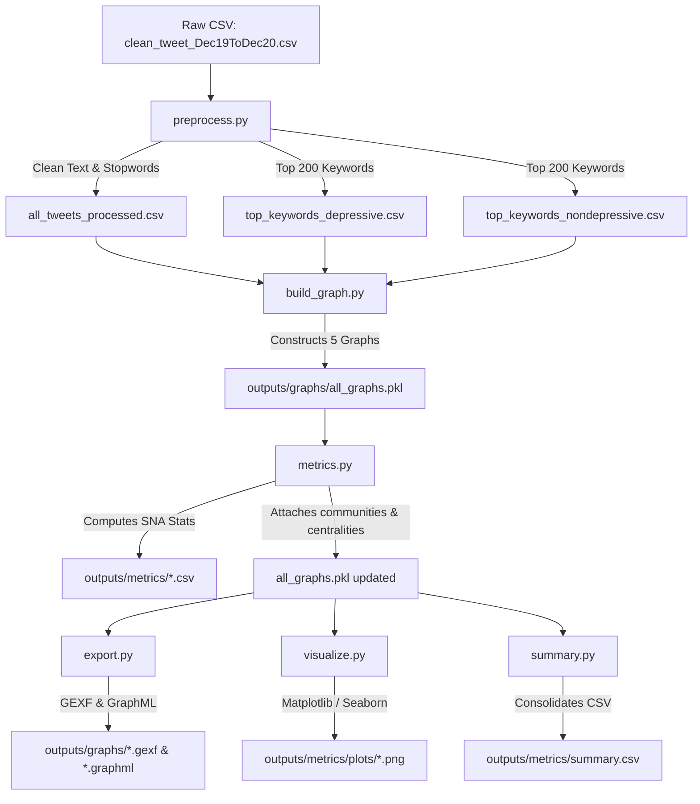

# 📊 Social Network Analysis of Depressive vs. Non-Depressive Tweets

<div align="center">
  
  
  
  
  
  
  
  
</div>

---

## 📖 Academic & Project Context

This repository contains a complete **Social Network Analysis (SNA)** project auditing and comparing the structural, relational, and community properties of depressive and non-depressive conversations on Twitter. 

Using the **IEEE DataPort dataset ("Depressive/Non-Depressive Tweets Between Dec'19 to Dec'20")** containing **134,348 tweets** collected during the COVID-19 pandemic, we explore how positive control conversations differ from depressive conversations using **Graph Theory** and **SNA metrics only**. 

> [!IMPORTANT]
> **Strict SNA Scope:** No machine learning, no AI classification, no predictive modeling of any kind is utilized. The dataset is already labeled with ground-truth sentiment, which we leverage to build separate parallel graphs.

---

## 🛠️ Technology Stack & Library Logos
We use the following libraries for graph construction, data cleaning, and modularity calculations:

*   **[Python 3.12](https://www.python.org/)** — Core coding environment.
*   **[Pandas](https://pandas.pydata.org/)** — Data loading, cleaning, and table exports.
*   **[NetworkX](https://networkx.org/)** — Graph data structure and graph-theoretic metric computation.
*   **[Python-Louvain](https://github.com/taynaud/python-louvain)** — Community detection and modularity score optimization.
*   **[Matplotlib](https://matplotlib.org/) & [Seaborn](https://seaborn.pydata.org/)** — Publication-quality degree distribution histograms and comparison charts.
*   **[Gephi](https://gephi.org/)** — External tool used for high-fidelity force-directed layouts (OpenOrd/Yifan Hu) of exported graphs.

---

## 🗺️ Project Pipeline & Execution Flow

Below is the end-to-end data pipeline showing how raw CSV tweets are cleaned, built into networks, mathematically analyzed, plotted, and exported:



---

## 📂 Repository Directory Tree

```directory
sna-depression-tweets/
├── data/
│   ├── raw/                  ← Original dataset csv (excluded from git tracking)
│   └── processed/            ← Preprocessed CSV files and top keyword lists
├── notebooks/                ← Scratchpads & exploratory code
├── src/                      ← Source code python package
│   ├── __init__.py
│   ├── preprocess.py         ← Text cleaning and keyword extraction
│   ├── build_graph.py        ← Graph construction (Co-occurrence, Similarity, Combined)
│   ├── metrics.py            ← Calculates density, centrality, Louvain partitions
│   ├── export.py             ← Exporter for Gephi (.gexf / .graphml)
│   ├── visualize.py          ← Plotting degree distributions & metrics
│   └── summary.py            ← Console reports and summary.csv generation
├── outputs/
│   ├── graphs/               ← Gephi files (.gexf / .graphml) and binary pickle
│   └── metrics/              ← CSV files & degree distribution plots
├── report/                   ← Gephi layout screenshots & written summaries
├── PROJECT_AUDIT.md          ← Consolidated full academic viva guide
├── requirements.txt          ← Python dependencies
└── README.md                 ← Consolidated landing page documentation
```

---

## ⚙️ Installation & Running the Pipeline

### 1. Prerequisite Setup
Clone the repository, create a Python virtual environment, and install all required libraries:
```bash
# Clone the repository
git clone https://github.com/SOUMYA0023/Social-Network-Analysis.git
cd Social-Network-Analysis/sna-depression-tweets

# Create virtual environment
python3 -m venv venv
source venv/bin/activate

# Install dependencies
pip install -r requirements.txt
```

### 2. Execute Pipeline Steps in Order
```bash
# Preprocess the raw tweets
python3 -m src.preprocess

# Construct the networks (Keyword Co-occurrence, Tweet Similarity, Combined)
python3 -m src.build_graph

# Calculate all graph-theoretic metrics
python3 -m src.metrics

# Export networks as GEXF & GraphML for Gephi
python3 -m src.export

# Plot degree distributions and metrics
python3 -m src.visualize

# Generate the consolidated summary CSV
python3 -m src.summary
```

---

## 📊 Summary of Computed SNA Metrics

Running the pipeline calculates the following values across our graph models (results are side-by-side in `outputs/metrics/summary.csv`):

| Network Category | Metric | Depressive Group (Subset 0 in Code) | Control Group (Subset 1 in Code) | Combined Network |
| :--- | :--- | :---: | :---: | :---: |
| **Keyword Network** | Nodes | 200 | 200 | 260 |
| | Edges | 19,007 | 18,805 | 28,309 |
| | Density | 0.9551 | 0.9450 | 0.8408 |
| | Avg Degree | 190.07 | 188.05 | — |
| | Avg Clustering Coeff | 0.9690 | 0.9681 | 0.9168 |
| | Communities (Louvain) | 4 | 4 | 5 |
| | Modularity Score | **0.0892** | **0.1449** | 0.1346 |
| **Tweet Similarity** | Nodes (sampled) | 1,171 | 1,059 | — |
| | Edges | 4,912 | 3,189 | — |
| | Density | 0.00717 | 0.00569 | — |
| | Avg Degree | 8.39 | 6.02 | — |
| | Communities (Louvain) | 73 | 100 | — |
| | Modularity Score | **0.7830** | **0.8226** | — |

---

## 💡 Key Research Insights

1.  **Semantic Repetitiveness**: Depressive discourse shows **lower modularity** ($0.0892$ vs $0.1449$) and **higher density** in keyword co-occurrences. This indicates that depressive conversations are structurally more uniform and integrated, repeatedly using the same negative feelings, symptoms, and topics across contexts.
2.  **Structural Consolidation**: Depressive tweets form **fewer connected components** (54 vs 82) and **fewer communities** (73 vs 100) in the similarity network compared to positive tweets. Positive control conversations cover a wider variety of separate topics, while depressive conversations focus on a smaller, more cohesive set of themes.
3.  **Bridge & Hub Nodes**: Public health terms like `health`, `govt`, and `cases` act as major bridges in the combined keyword network. The top central nodes in the depressive network are `broken`, `sad`, `india`, `awful`, and `health`, showing how closely the distress was linked to the pandemic context.

---

## 🎓 Viva Voice Exam Preparation
For a detailed guide on how to defend this project, including **20 common exam questions** covering graph construction decisions, limitations, modularity interpretations, and library choices, please refer to our comprehensive study guide:

👉 **[PROJECT_AUDIT.md](file:///Users/soumyasumankar/Desktop/SNA/sna-depression-tweets/PROJECT_AUDIT.md)**
